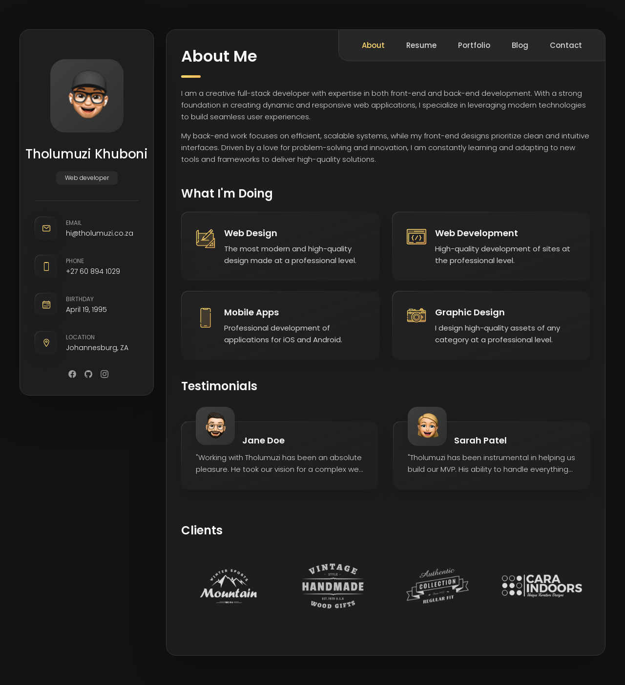

# Tholumuzi Portfolio
## Preview

Welcome to my personal portfolio website! This site showcases my skills, projects, and experience as a Full Stack Developer. I built it using HTML, CSS, and JavaScript.

## Website URL

[tholumuzi.co.za](https://tholumuzi.co.za)

## Features

- **Responsive Design**: The site is fully responsive, ensuring an optimal viewing experience across a wide range of devices, from desktops to mobile phones.
- **About Me Section**: Learn more about me, my background, and my passion for development.
- **Projects Showcase**: A display of my favorite projects, including code samples and live demos.
- **Contact Form**: A simple form to reach out to me directly from the website.
- **Social Media Links**: Easily connect with me through my social media profiles.

## Tech Stack

- **HTML5**: Structuring the content of the website.
- **CSS3**: Styling the website and ensuring a responsive design.
- **JavaScript**: Adding interactivity to the site, including smooth scrolls, form validation, and dynamic content display.

## How to Use

1. Visit the website: [tholumuzi.co.za](https://tholumuzi.co.za)
2. Browse through the sections to learn more about my work and experience.
3. Use the contact form to send a message or connect via social media.

## Future Enhancements

- Adding a blog section to share my thoughts on technology and development.
- Implementing dark mode for a better user experience.
- Further improving the performance and SEO.

## License

This project is open source. You can use it freely, but credit is appreciated.

## Contact

Feel free to connect with me via the following platforms:

- GitHub: [/tholumuzikhuboni](https://github.com/tholumuzikhuboni)
